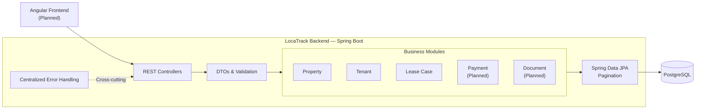

# Architecture

## Overview

LocaTrack is designed as a **modular monolith** with a clear separation between:

- frontend application
- backend application
- relational database

The system is intentionally kept simple in terms of deployment, while maintaining clear domain boundaries and internal modularity.

The frontend communicates with the backend through REST APIs. Requests are validated and mapped through DTOs before reaching the business modules, while persistence is handled through Spring Data JPA and PostgreSQL. Cross-cutting concerns such as error handling are managed centrally.

---

## High-Level Architecture

### Frontend
The frontend is a web application built with Angular.

It is responsible for:
- rendering the user interface
- handling navigation and forms
- calling backend REST APIs
- displaying lease, tenant, property, payment, and document data

### Backend
The backend is a Spring Boot application exposing REST APIs.

It is responsible for:
- enforcing business rules
- validating input data
- managing the lease workflow lifecycle
- handling persistence
- providing structured responses to the frontend

### Database
The system uses a relational database to store:
- properties
- units
- tenants
- lease cases
- payments
- documents
- status history

---

## Architectural Style

### Modular Monolith

The backend is implemented as a **modular monolith**.

This means:
- a single deployable backend application
- a single main codebase
- clear internal separation by business domain

Main backend domains include:
- property
- unit
- tenant
- leasecase
- payment
- document
- common

This approach was chosen because it provides:
- lower complexity
- faster development
- easier debugging
- clearer learning value
- enough structure for future evolution

---

## Backend Internal Structure

The backend follows a layered architecture:

- **Controller**: handles HTTP requests and responses
- **Service**: contains business logic and workflow rules
- **Repository**: handles database access
- **Entity**: represents persistence models
- **DTO**: defines request and response contracts
- **Mapper**: maps inputs and output responses to dto 

This separation helps keep the code:
- readable
- maintainable
- testable
- consistent

---

## Frontend Internal Structure

The frontend is organized by feature and responsibility.

Main frontend areas include:
- authentication
- dashboard
- properties
- units
- tenants
- lease cases
- payments
- documents
- shared components

The frontend is responsible for user interaction, while the backend remains the source of truth for business rules.

---

## Communication Model

The frontend communicates with the backend through JSON-based REST APIs.

Typical flow:
1. user action in the Angular UI
2. HTTP request to backend API
3. backend validation and business processing
4. persistence in database
5. structured response returned to frontend
6. UI refresh based on response

---

## Business Rule Ownership

Business rules are enforced in the backend.

Examples:
- a unit cannot have more than one ACTIVE lease case at the same time
- a lease case must reference an existing tenant and an existing unit
- each status change must be recorded in history

The frontend may guide the user, but the backend remains the final source of validation and consistency.

---

## Why Not Microservices

Microservices were intentionally not chosen for this project.

At this stage, they would add:
- deployment complexity
- service-to-service communication overhead
- more difficult debugging
- unnecessary operational complexity

A modular monolith is a better fit for:
- a focused portfolio project
- faster implementation
- stronger architectural clarity

---

## Architectural Goals

The project aims to demonstrate:
- clean separation of concerns
- realistic domain modeling
- modular backend organization
- a consistent fullstack workflow
- a maintainable and extensible foundation
